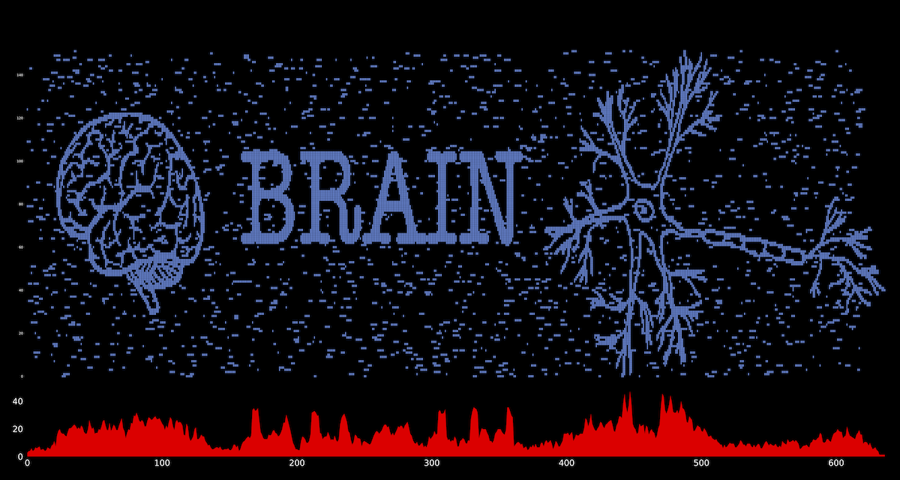

=====================
Synthetic Raster Plot
=====================

A little side fun project, using the code from DeepCINAC project,
that generate synthetic raster plot with the option to illustrate it the way it is done on the image below.

A synthetic calcium imaging movie that matches this raster is also produced, as well as some other data.

